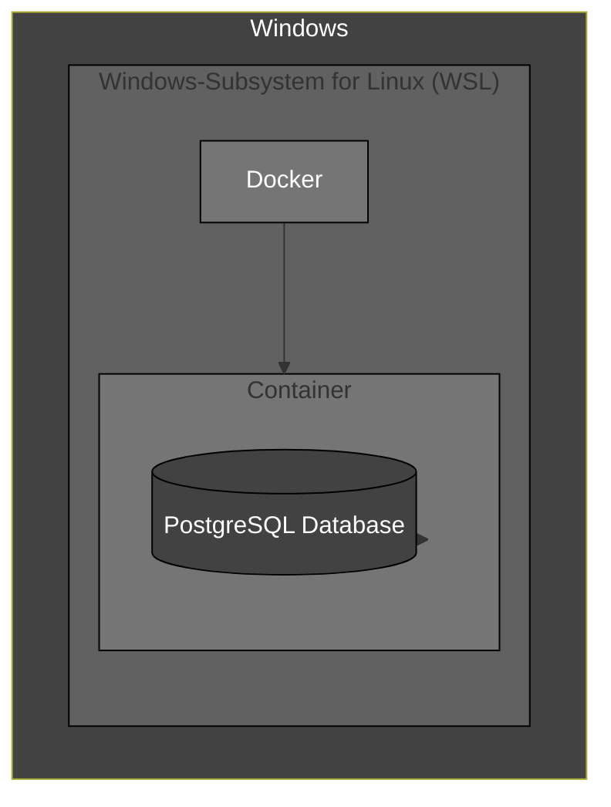
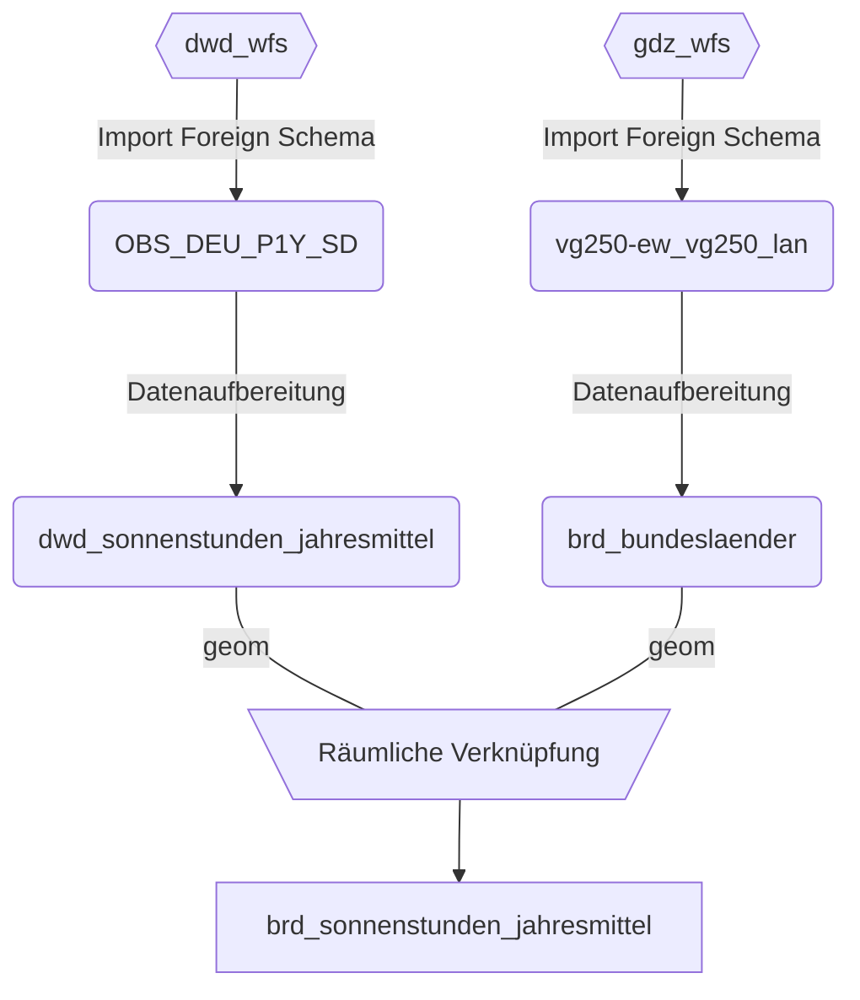

# Gliederung
### 01 [Infrastruktur](#01-infrastruktur)
### 02 [Docker Compose](#02-docker-compose)
### 03 [Datenbank](#03-datenbank)


# 01 Infrastruktur

- **Windows:** Entwicklungsumgebung, Verwaltung von WSL2
- **WSL2:** Natives entwickeln auf Linux mit allen seinen Vorteilen.
- **Docker:**  Eine Anwendung mit allen ihren Abhängigkeiten in einem "Container". Abgsehen von der "Docker Engine" unabhängig lauffähig. Somit ist es deutlich leichter komplexe Systeme mit wenigen Zeilen Code zum laufen zu bringen.

# 02 [Docker Compose](https://github.com/ArvoK/postgis-dwd/blob/main/docker-compose.yml)

Die Docker Compose-Datei [docker-compose.yml](https://github.com/ArvoK/postgis-dwd/blob/main/docker-compose.yml) definiert ein PostGIS-Setup mit pgAgent für die Ausführung geplanter Aufgaben in der Datenbank.

## Services

### `gis_database`

* **Image:** `postgis/postgis:16-3.4`
   - Verwendet das offizielle PostGIS Docker-Image, das PostgreSQL mit PostGIS-Erweiterungen für räumliche Daten kombiniert.
   - Die Version `16-3.4` bezieht sich auf PostgreSQL 16 und PostGIS 3.4.

* **Container Name:** `gis_database`
   - Benennt den Container, um ihn leichter identifizieren zu können.

* **Ports:**
   - `5433:5432`
      - Leitet Port 5433 auf dem Host-System zu Port 5432 im Container weiter.
      - PostgreSQL läuft standardmäßig auf Port 5432.

* **Environment:**
   - `POSTGRES_PASSWORD: gis_database_pw`
      - Setzt das Passwort für den PostgreSQL-Benutzer `postgres`.
      - Ersetze `gis_database_pw` durch ein sicheres Passwort.

* **Volumes:**
   - `gisdata:/var/lib/postgresql/data`
      - Speichert die PostgreSQL-Daten persistent im benannten Volume `gisdata`.
      - Dadurch bleiben die Daten auch nach dem Stoppen des Containers erhalten.

* **Command:**
   - `bash -c "apt-get update && apt-get install -y --no-install-recommends postgresql-16-ogr-fdw && apt-get update && apt-get install -y pgagent && docker-entrypoint.sh postgres"`
      - Führt eine Reihe von Befehlen aus, wenn der Container gestartet wird:
         1. Aktualisiert die Paketliste (`apt-get update`).
         2. Installiert den PostgreSQL Foreign Data Wrapper für OGR (`postgresql-16-ogr-fdw`) zur Verbindung mit anderen GIS-Datenquellen.
         3. Installiert pgAgent für die Ausführung geplanter Aufgaben.
         4. Startet den PostgreSQL-Dienst mit dem Standard-Entrypoint-Skript.

## Volumes

### `gisdata`

* **Name:** `gisdata`
   - Definiert ein benanntes Volume, um die PostgreSQL-Daten persistent zu speichern.

## Verwendung

1. Starte den Container mit `docker compose up -d`.
2. WSL2 IP-Adresse herausfinden: `wsl hostname -I `.  
3. IP-Adresse ersetzen  
  
4. Passwort eingeben(`gis_database_pw`)  
  


# 03 Datenbank
## Query Tool starten:  


## Vorhandene Erweiterungen überprüfen:
```postgresql
SELECT * FROM pg_extension;
```
## Erweiterungen in Datenbank installieren:
```postgresql
CREATE EXTENSION pgagent;
CREATE EXTENSION ogr_fdw;
```

## Neues Schema anlegen:
```postgresql
CREATE SCHEMA daten;
```

## Daten Importieren

### Schematische Darstellung


### Skripte aus dem sql Ordner geordnet ausführen