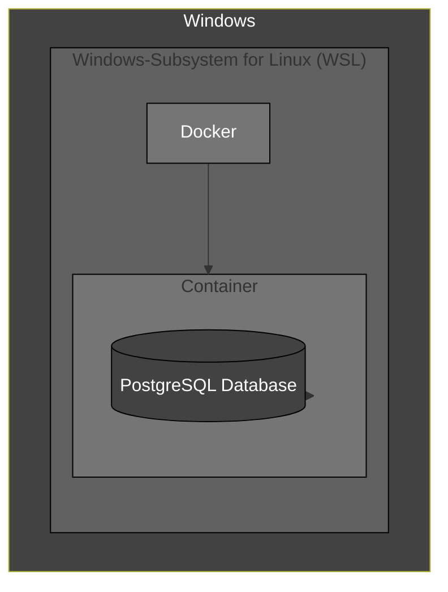
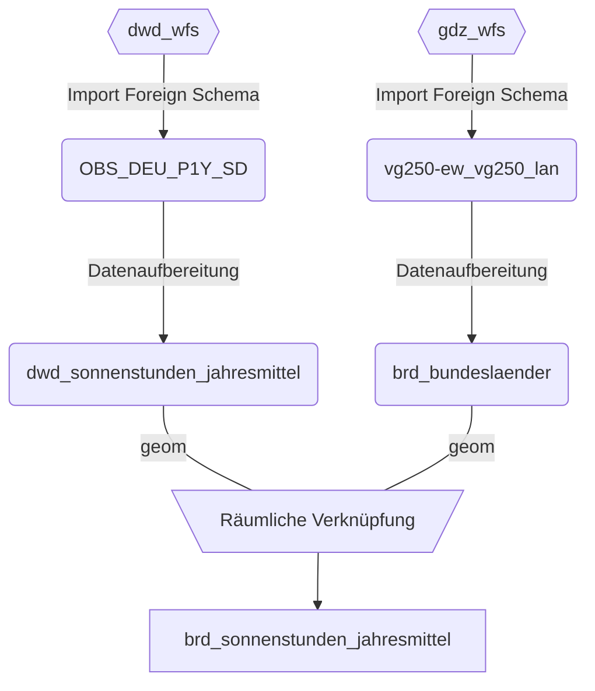

## Infrastructure

- **Windows:** Entwicklungsumgebung, Verwaltung von WSL2
- **WSL2:** Natives entwickeln auf Linux mit allen seinen Vorteilen.
- **Docker:**  Eine Anwendung mit allen ihren Abhängigkeiten in einem "Container". Abgsehen von der "Docker Engine" unabhängig lauffähig. Somit ist es deutlich leichter komplexe Systeme mit wenigen Zeilen Code zum laufen zu bringen.


### Datenbank
Vorhandene Erweiterungen überprüfen:
```postgresql
SELECT * FROM pg_extension;
```
Erweiterungen in Datenbank installieren:
```postgresql
CREATE EXTENSION pgagent;
CREATE EXTENSION ogr_fdw;
```

Neues Schema anlegen:
```postgresql
CREATE SCHEMA daten;
```
Daten Pipeline

