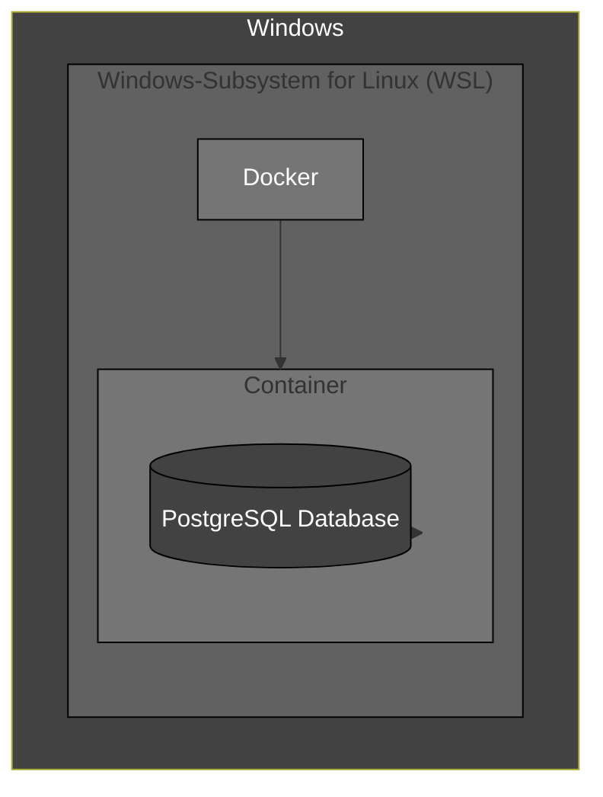

### Vorraussetzungen
- Windows 10, Version 2004 und höher
- [Docker Desktop (Windows)](https://www.docker.com/products/docker-desktop/)
- [PG-Admin(Windows)](https://www.pgadmin.org/)

### Nice to have
- [Windows Terminal](https://apps.microsoft.com/detail/9n0dx20hk701?hl=de-de&gl=DE)

## Infrastructure

- **Windows:** Entwicklungsumgebung, Verwaltung von WSL2
- **WSL2:** Natives entwickeln auf Linux mit allen seinen Vorteilen.
- **Docker:**  Eine Anwendung mit allen ihren Abhängigkeiten in einem "Container". Abgsehen von der "Docker Engine" unabhängig lauffähig. Somit ist es deutlich leichter komplexe Systeme mit wenigen Zeilen Code zum laufen zu bringen.

## Docker Container Starten
### Code
```bash
sudo docker run -d \
--name=gis_database \
-p 5433:5432 \
-e POSTGRES_PASSWORD=gis_database_pw \
postgis/postgis:16-3.4
```

### Beschreibung

1. **sudo:**  
sudo steht für "Superuser Do". Es wird verwendet, um den Befehl mit "Admin-Berechtigungen" auszuführen.

2. **docker run:**  
Dies ist der grundlegende Befehl zum Ausführen eines Docker-Images.

3. **-d:**  
Der Container läuft auch wenn die Konsole geschlossen wird.

4. **--name=gis_database:**  
Die Option gibt dem Container einen Namen.

5. **-p 5433:5432:**  
Es wird Port 5433 auf dem Host-System mit Port 5432 im Container verbunden. Dies bedeutet, dass man  über den Port 5433 auf den Postgres-Server im Container zugreifen kann.

6. **-e POSTGRES_PASSWORD=gis_database_pw:**
Die Option setzt eine Umgebungsvariable im Container. In diesem Fall wird die Umgebungsvariable POSTGRES_PASSWORD auf den Wert 'gis_database_pw' gesetzt. Dies ist das Passwort, mit dem wir uns bei der Postgres-Datenbank im Container anmelden können.

7. **postgis/postgis:16-3.4:**  
Dies ist das Image, das zum Ausführen des Containers verwendet wird. Das Image stammt vom Repository postgis und hat die Tag-Version 16-3.4. Dies bedeutet, dass das Image Postgres 16.3 mit PostGIS-Erweiterungen enthält.


## ogr_fdw Installieren

### Code
**1. Container id abfragen:**
```bash
sudo docker ps -aqf "name=gis_database"
```
**2. Container Konsole betreten:**
```bash
docker exec -it .... sh
```
**3. ogr-fdw im Container installieren:**
```bash
apt-get update && apt-get install -y --no-install-recommends postgresql-16-ogr-fdw
apt-get update && apt-get install pgagent
```
